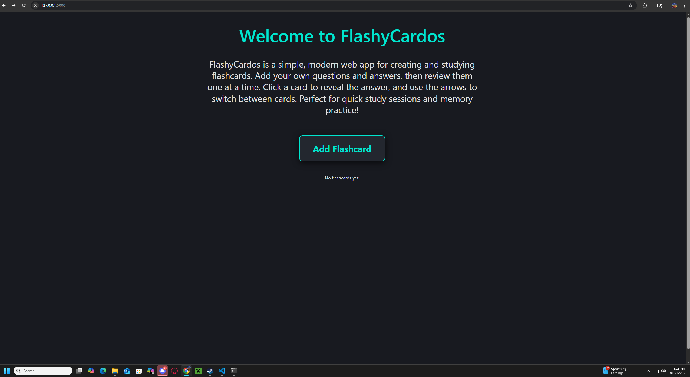

# Study Tool Web Application

The Study Tool Web Application is a modern, user-friendly web app designed to help users create, manage, and review flashcards for effective studying. Built with Flask, it provides a simple interface for organizing study materials and improving retention through active recall.

## Technologies Used
- Python
- Flask
- HTML/CSS

## Features
- Create, edit, and delete flashcards
- Review flashcards in a clean, distraction-free interface
- Responsive and visually appealing design
- Easy to use and lightweight

## Installation

1. **Clone the repository:**
	```powershell
	git clone https://github.com/LGWillis/Study-Tool-Web-Application.git
	cd Study-Tool-Web-Application
	```

2. **Install dependencies:**
	Ensure you have Python 3.7+ installed. Then, install required packages:
	```powershell
	pip install -r requirements.txt
	```

## How to Run

1. **Start the application:**
	```powershell
	python app.py
	```

2. **Access the web app:**
	Open your browser and go to [http://127.0.0.1:5000](http://127.0.0.1:5000)

3. **Create and review flashcards:**
	- Add new flashcards using the interface
	- Review and manage your study materials

## Image of App Running

