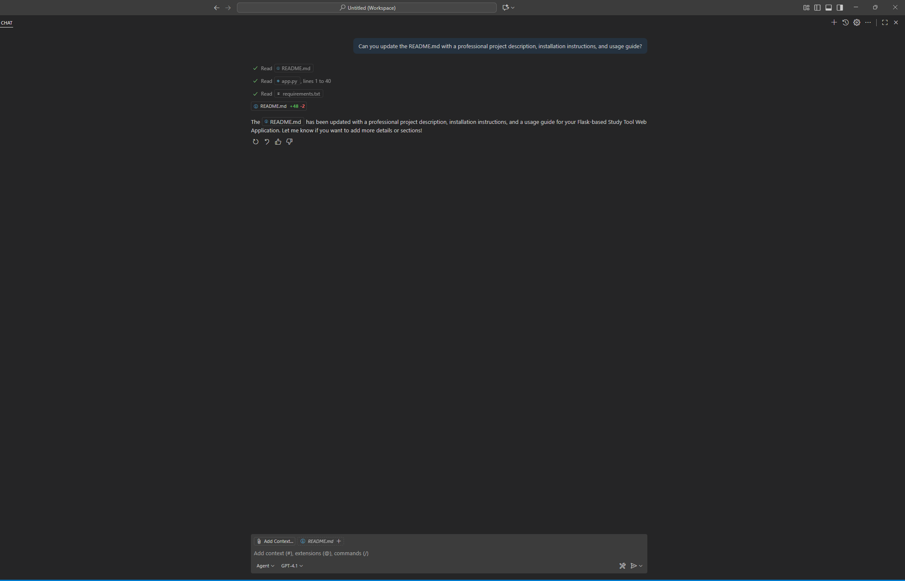

1. What did you ask Copilot to help you build? How did you break down the problem?
    I asked copilot to assist me with building a web application using Python and Flask that allowed users to create and study flashcards. I broke down the problem by asking copilot questions about the app one at a time. For example, I used Copilot to a propose a feature that flips the flash card if the user clicks on it.
    
    

2. How did your approach to asking questions change as you worked?
    As I contiued to work, my questions got more specific as I started to envision what I wanted the app to do and look like.

3. What parts of the development process with GitHub Copilot surprised you?
    I was surprised by how accurated the changes proposed by Copilot were based on my questions. It really nailed what I pictured in my head about how the app would look and run. 

4. What did you learn about the technology you used that you didn't know before?
    I learned that Flask can be used with Python to create web applications. Before this assignment and before I used Copilot, I wasn't familiar with Flask. Now I know it is a microframework written into Python and is primarly used to develop web applications.

5. What would you do differently if you had to build this again?
    I would start out with more specific questions in order to perfect my app. I asked Copilot a lot of broad questions to begin with, which made it difficult to change the app later on.